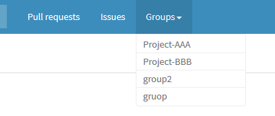

gitbucket-groupsmenu-plugin
===

The plugin shows groups dropdown in header menu for [GitBucket](https://github.com/gitbucket/gitbucket).

Version
---

Plugin version|GitBucket version
:---|:---
1.0.0|4.8+

Download
---

You can download a jar file from the [Release](https://github.com/tomoki1207/gitbucket-groupsmenu-plugin/releases).

Installation
---

Download a jar file and put into `GITBUCKET_HOME/plugins` and then restart GitBucket.